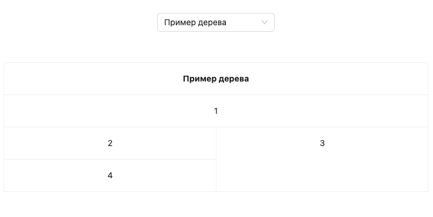

# Задача.

Задача: отобразить дерево с данными с помощью таблицы.

## Описание:

Существует компонент `TreeAsTableComponent`, который принимает в качестве входного параметра дерево. Данные имеют следующий интерфейс:

```javascript
  interface ITreeNode {
    val: string | number;
    id: string;
    children?: ITreeNode[]
  }
```

Необходимо отобразить структуру дерева с помощью таблицы, используя компонент таблицы одной из популярный ui-библиотек. Для `react`-приложения предлагается использовать библиотеку `antd`.

Пример: данное дерево

```javascript
  {
    val: 1,
    id: '84b70dd1-376d-4795-b3d4-0a0a32663008',
    children: [
      {
        val: 2,
        id: '5d8a7729-728c-455c-a576-ddab5bb32908',
        children: [
          {
            val: 4,
            id: '517eb8fb-8e8f-4e4f-9c2b-748a03a7bbed'
          }
        ]
      },
      {
        val: 3,
        id: '54cad34d-de38-4e98-b2f3-b2f68ce32c1a'
      },
    ]
  }
```

должно отобразиться с помощью таблицы следующим образом:


